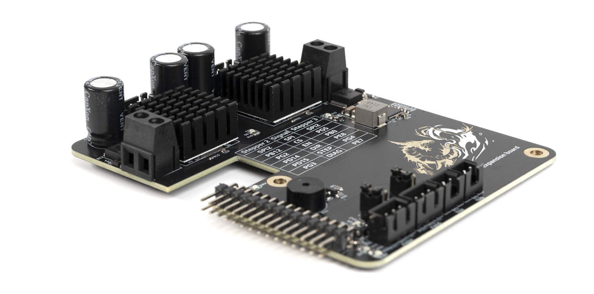

# Leviathan Extension Board

The Leviathan Extension Board is a plug and play PCB that expands the feature set of the original Leviathan controller board. It adds: 

- 2x Integrated TMC5160 stepper drivers. 
- 2x Fan ports with flyback protection, 12V/24V selectable voltage, and tachometer inputs. 
- 2x Thermistor ports with 2k2 ohm pullup resistors. 
- 1x Piezo Buzzer

## Electrical Specifications

| Parameter                 | Symbol             | Min | Typ | Max | Unit | Comments                                      |
| ------------------------- | ------------------ | --- | --- | --- | ---- | --------------------------------------------- |
| HV Stepper Supply Voltage | VHV     | 24  | 48  | 55  | V    | Supply voltage for the HV stepper drivers     |
| Fan Current               | Ifan    |     |     | 0.5 | A    | Current rating per fan channel                |
| HV Stepper Current        | Ihv_mot |     |     | 3   | A    | Current rating of each TMC5160 stepper driver |

## Creating a Custom Extension PCB

Did you ever want to create your own custom extension board? We have a [template KiCad project](https://github.com/MotorDynamicsLab/Leviathan-Ext-Template) to help get you started. 